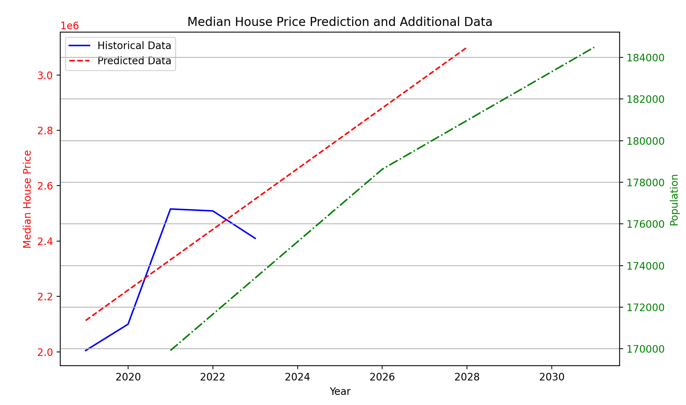
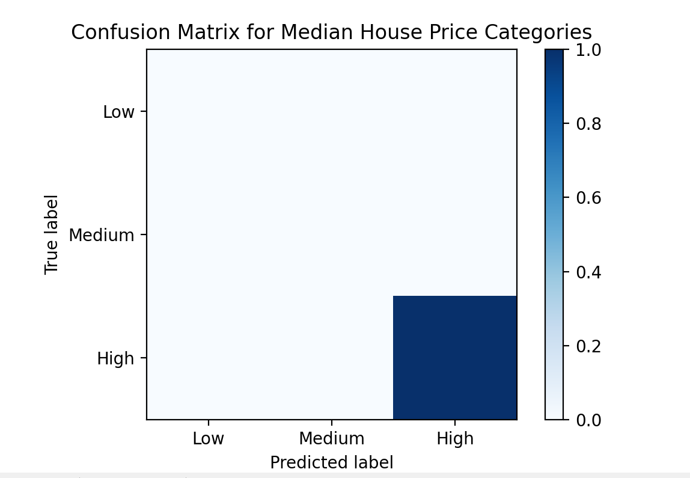

# House Hustlers

Our group - **House Hustlers**, has been working on a machine model aimed to leverage historical housing market data and population datasets to predict future trends and fluctuations in the real estate market in the **City of Boroondara**. 

This is a **Python mahcine learning program** using *pandas*, *scikit-learn* & *matplotlib*. By Analysing key variables such as property prices, demographic shifts, and population growth patterns, this program seeks to provide valuable insight for stakeholders, including potential homebuyers, investors, and policy makers. 

The ultimate goal is to forecast future changes in the housing market, helping to inform strategic decisions and improve planning in the real estate industry.

## Authors:
| Name | Student ID |
| ----- | ---- | 
| Kimsakona SOK | 104526322 |  
| Hayden Janecic | 105339990 |
| Haoqian Huang | 104312084 |

## Datasets:
- **Housing_Data.csv:** This contains the historical housing data (house prices, rents, sales volumes, etc.) for the City of Boroondara.
- **Forecast_Pop_By_Area.csv:** This contains the forecast population data for the City of Boroondara.

Make sure these files are correctly named and placed in the root of the project directory.

## Setup:

Before training the models, ensure you have installed the necessary Python libraries. To do this, follow the steps below:

1. **Clone or download the repository**:
   - Download the project files and place them in a directory on your system.

2. **Install dependencies**:
   Install the required libraries using `pip`:
   ```bash
   pip install pandas scikit-learn matplotlib
   ```
Once the environment is set up, you can proceed to train the models. The following instructions detail how to train each model and customize the parameters:

### 1. **Training the Linear Regression and Decision Tree Regressor Models**:

1. **Load the Dataset**:
   - Ensure that the `Housing_Data.csv` and `Forecast_Pop_By_Area.csv` files are in the root of the project directory.
   - These datasets contain the historical housing market data and population data for the City of Boroondara.

2. **Run the Training Script**:
   - To train the **Linear Regression** and **Decision Tree Regressor** models, run the respective script by executing the following command:
   ```bash
   python linear_regression.py  # For Linear Regression
   python decision_tree_regressor.py  # For Decision Tree Regressor
   ```

3. **Adjust Parameters**:
   - If needed, you can adjust the following parameters directly in the script:
     - **Year Range**: Adjust the year range for predictions (up to 2028) by modifying the code where future years are generated.
     - **Population Data**: The population data is currently limited to 2021, 2026, and 2031. Extend this based on additional data if available.

4. **View Prediction Results**:
   - Once training is complete, the script will generate predictions and display **RMSE** and **MAE** metrics.
   - Additionally, graphs will be generated comparing the predicted values with historical data and population trends.

### 2. **Training the Random Forest Classifier**:

The **Random Forest Classifier** is used to classify house prices, rental prices, and sales/rental volumes into categories (Low, Medium, High).

1. **Run the Training Script**:
   - To train the Random Forest Classifier model, run the following command:
   ```bash
   python random_forest_classifier.py
   ```

2. **Adjust Hyperparameters**:
   - You can modify parameters like `n_estimators` (number of trees) and `max_depth` in the script to fine-tune the model. Adjust these values based on the complexity of the dataset:
     ```python
     classifier = RandomForestClassifier(n_estimators=100, max_depth=10, random_state=42)
     ```

3. **View Classification Results**:
   - After training, the script will output a **classification report**, **accuracy score**, and **confusion matrix** to evaluate model performance.
   - You will also see graphs showing categorized house prices, rental prices, and sales/rental volumes over time, visualized alongside historical data.

## Guide - Prediction (Linear Regression & Decision Tree Regressor)

Once the models are trained, you can use them to make predictions for future house prices, rents, and sales volumes. The following steps guide you through the prediction process:

1. **Predict Future Housing Prices and Volumes**:
   After running the respective model script, predictions for future years (up to 2028) will be made automatically. The predicted house prices and volumes are plotted against historical data and population growth.

2. **Predict Rental Prices and Volumes**:
   Similarly, predictions for rental prices and sales volumes will be generated by the scripts. Visualisations are also created for a comprehensive comparison.

### Example Prediction Output:
Upon running a model script, you will see the following:
- **RMSE and MAE Metrics**: The script prints out the **Root Mean Squared Error (RMSE)** and **Mean Absolute Error (MAE)** for the predictions.
- **Graphs**: You will see plots comparing predicted house prices, rents, or sales volumes with historical data and population growth trends.

## Guide - Analysis (Random Forest Classifier)

The **Random Forest Classifier** model is used to categorize house prices, rental prices, and sales volumes into **Low, Medium, and High** categories. Once the model is trained, it can provide insights on the market segmentation, allowing you to understand which segments (e.g., affordable, mid-range, luxury) are likely to grow or shrink over time. Below is a step-by-step guide on how to use the model for predictions:

1. **Predict Future Price Categories**:
   After running the Random Forest Classifier script, predictions will be made for future years (up to 2028) on house prices, rental prices, and sales/rental volumes. These predictions will classify the data into **Low, Medium, and High** price or volume categories, allowing you to understand shifts in the market.

2. **Analyze Market Segments**:
   The predictions will reveal which price categories are most prevalent in future years. For example, if the classifier predicts that more houses will fall into the "High" price category, this could indicate a trend toward luxury housing. Similarly, shifts between "Low" and "Medium" rental volumes can indicate changes in market demand or supply dynamics.

3. **Confusion Matrix and Accuracy Scores**:
   The script will also generate a confusion matrix and accuracy score for the model, showing how well the classifier performed on the test data. This helps to evaluate the model’s effectiveness in categorizing the different price/volume ranges and provides insight into potential areas for model improvement.

### Example Prediction Output:
Upon running the Random Forest Classifier script, you will receive the following outputs:
- **Accuracy and Classification Report**: The script will display the **accuracy** of the predictions, along with a **classification report** that provides precision, recall, and F1-scores for each category (Low, Medium, High).
- **Confusion Matrix**: You will see a **confusion matrix**, which compares the actual vs. predicted categories, giving you a deeper understanding of how well the model categorizes price and volume data.
- **Graphs**: The model will generate plots that show the predicted categories (Low, Medium, High) for house prices, rents, and sales/rental volumes over time, visualized alongside historical data and population growth trends.

### How to Interpret the Results:
- **Low, Medium, High Categories**: The classifications help identify shifts in market segments. For instance, an increase in "High" category predictions suggests rising house prices or rental prices.
- **Confusion Matrix**: This helps assess where the model misclassified data, providing insight into the robustness of the model for different market segments.
- **Graphs**: Visualize how the predictions compare to historical trends, helping to understand the future outlook of the housing and rental markets.


## Detailed Explanation - Model Training:
The models used in this project are **Linear Regression**, **Decision Tree Regressor**, and **Random Forest Classifier**. The regression models are trained on the Year feature, and predictions are made for future years (up to 2028). 

Additionally, the **Random Forest Classifier** is used to categorise prices (Low, Medium, High) rather than predicting exact prices, perfect for data analysis. It is employed to categorise house prices, rental prices, and sales/rental volumes into Low, Medium, and High categories by analyzing historical data patterns and detecting trends over time.

Here's the updated comparison between the models in a table format:

| **Model**                   | **Description**                                                                 | **Advantages**                                                                                           | **Disadvantages**                                                                                          |
|-----------------------------|---------------------------------------------------------------------------------|-----------------------------------------------------------------------------------------------------------|------------------------------------------------------------------------------------------------------------|
| **Linear Regression**        | Assumes a linear relationship between input (Year) and output (house prices).   | - Simple and easy to interpret. <br> - Efficient for linear trends.                                        | - Struggles with non-linear patterns (underfitting). <br> - Sensitive to outliers.                         |
| **Decision Tree Regressor**  | Recursively splits data based on input to predict target values.                | - Handles non-linear relationships well. <br> - Robust to outliers. <br> - Easy to visualize and interpret. | - Prone to overfitting. <br> - High variance. <br> - Can become complex for large datasets.                |
| **Random Forest Classifier** | Combines multiple decision trees to categorise data (e.g., price categories).   | - Reduces overfitting compared to a single decision tree. <br> - Can handle complex, non-linear data.       | - Requires large amounts of data for accurate classification. <br> - Less interpretable compared to simpler models. |


### Model Parameters


Regression - 
- **Year Range**: You can adjust the year range for predictions in the scripts (up to 2028).
- **Population Data**: The population data is already limited to 2021, 2026, and 2031. You can extend this based on additional data, if available.

Classifier -
- **Random Forest Hyperparameters**: Parameters like `n_estimators` (number of trees) and `max_depth` can be adjusted to fine-tune the performance of the Random Forest Classifier.
